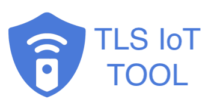

	

 

# open-tls-iot-client

### Introduction

This open source project is co-sponsored by Tracmo, Inc. The goal is to build an end-to-end secured MQTTs communication to control an end IoT device. The target is to build a tool supporting the following features:
* Use only X.509 to authenticate and secure the communication
* Support CA Root authentication
* Support Face ID or Touch ID
* Prevent Middle-Man Attack
* No need to set a NAT port forward for the end IoT device

### How is this project organized?

| Folder     | Description                                                  |
|------------|--------------------------------------------------------------|
| [esp32](https://github.com/tracmo/open-tls-iot-client/tree/main/esp32)      | Source and the binary build of ESP32 based target IoT Device |
| [images](https://github.com/tracmo/open-tls-iot-client/tree/main/images)     | Icon and image files                                         |
| [ios](https://github.com/tracmo/open-tls-iot-client/tree/main/ios)        | Source code of the iOS app                                   |
| [test_tools](https://github.com/tracmo/open-tls-iot-client/tree/main/test_tools) | Test tools to simulate the target IoT Device                 |
| [ifttt_webhook](https://github.com/tracmo/open-tls-iot-client/tree/main/ifttt_webhook) | Lambda Function for AWS IoT Rule Engine                 |

### More Information

Each folder has its own README document. Please open the folder to see the document. For the overall technical instructions, please go to the project Wiki page.

[Open TLS IoT Wiki](https://github.com/tracmo/open-tls-iot-client/wiki)

### Example

I took this project to build a smartphone-based garage door control. I could not find a good alternative so I decided to initiate a new one.

This is the app screen.

The remote control box built with an ESP32-PICO-MINI-02 kit.

This is the video to demonstrate how it works.

For more information, please check [the full demo videos](https://github.com/tracmo/open-tls-iot-client/wiki/Demo).

### Contributors

| Contributor | Contact                  | Roles                                      |
|-------------|--------------------------|--------------------------------------------|
| Samson Chen | samson AT mytracmo.com   | Project Coordinator, ESP32, Documentations |
| Eric Jan    | janeric11yt AT gmail.com | iOS Core App                               |
| Jie Chien   | jie AT mytracmo.com      | App Icon and Style Design                  |
| Shaofu Cu   | shaojeng AT gmail.com    | iOS App and Release                        |
| Enos Wu     | p510132006 AT gmail.com  | ESP32 Development                          |

We welcome your participations. If you are interested in joining this project, please email us via
opensource AT mytracmo.com

### The App

Open TLS MQTT Client in iOS

	

 

Android app is not there yet. If you are interested to be the contributor, please contact us.

### LICENSE

MIT License

Copyright (c) 2020 Tracmo, Inc.

Permission is hereby granted, free of charge, to any person obtaining a copy
of this software and associated documentation files (the "Software"), to deal
in the Software without restriction, including without limitation the rights
to use, copy, modify, merge, publish, distribute, sublicense, and/or sell
copies of the Software, and to permit persons to whom the Software is
furnished to do so, subject to the following conditions:

The above copyright notice and this permission notice shall be included in all
copies or substantial portions of the Software.

THE SOFTWARE IS PROVIDED "AS IS", WITHOUT WARRANTY OF ANY KIND, EXPRESS OR
IMPLIED, INCLUDING BUT NOT LIMITED TO THE WARRANTIES OF MERCHANTABILITY,
FITNESS FOR A PARTICULAR PURPOSE AND NONINFRINGEMENT. IN NO EVENT SHALL THE
AUTHORS OR COPYRIGHT HOLDERS BE LIABLE FOR ANY CLAIM, DAMAGES OR OTHER
LIABILITY, WHETHER IN AN ACTION OF CONTRACT, TORT OR OTHERWISE, ARISING FROM,
OUT OF OR IN CONNECTION WITH THE SOFTWARE OR THE USE OR OTHER DEALINGS IN THE
SOFTWARE.

### Acknowledgements

This project makes use of the following third party libraries:

##### [MQTT Client Framework](https://github.com/novastone-media/MQTT-Client-Framework)

License
https://github.com/novastone-media/MQTT-Client-Framework/blob/master/LICENSE

##### [Open SSL for iOS](https://github.com/x2on/OpenSSL-for-iPhone)

License
https://github.com/x2on/OpenSSL-for-iPhone/blob/master/LICENSE

##### [Keychain Swift](https://github.com/evgenyneu/keychain-swift)

License
https://github.com/evgenyneu/keychain-swift/blob/master/LICENSE

##### [CryptoSwift](https://github.com/krzyzanowskim/CryptoSwift)

License
https://github.com/krzyzanowskim/CryptoSwift/blob/master/LICENSE

This product includes software developed by the "Marcin Krzyzanowski" (http://krzyzanowskim.com/).
